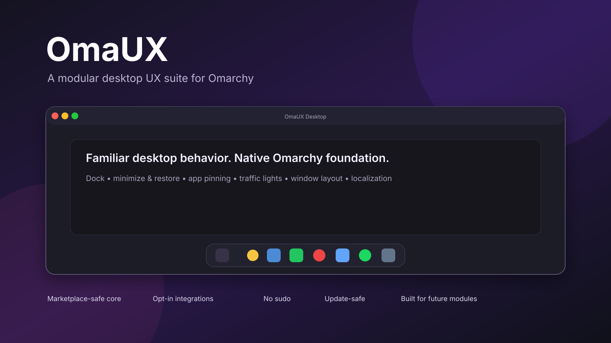

# OmaUX

OmaUX is a modular desktop UX enhancement pack for Omarchy. It brings a polished application dock, real minimize/restore, persistent app pinning, macOS-style window controls, optional Ukrainian localization, and other quality-of-life improvements to Hyprland-based Omarchy desktops.

> Current status: **0.1.0-alpha.1** — actively developed. The project is intentionally modular so new UX modules can be added without redesigning the core.



## Highlights

- macOS-style bottom Dock for pinned and running applications
- Real minimize → Dock → restore workflow for Hyprland
- Persistent app pinning, including pin/unpin from the Omarchy application list
- macOS-style traffic-light window controls with close, minimize, maximize/restore
- Correct tiled/floating state restoration after maximize
- Windows-like window placement helpers
- Optional Ukrainian UI/localization layer
- Optional 1-hour auto-suspend profile with passwordless resume
- Chrome system-frame integration to avoid duplicate window controls
- Update-safe, modular architecture with explicit opt-in system integrations

## Installation

### Marketplace/Core

```bash
omarchy plugin add https://github.com/eNgine9r/omaux.git --enable
```

The Marketplace/Core layer is designed to be safe: it does not require `sudo` and does not silently rewrite `/usr/share/omarchy`.

### Full UX profile

Clone the repository and run the installer explicitly:

```bash
git clone https://github.com/eNgine9r/omaux.git
cd omaux
./install.sh --full
```

The full profile enables the optional integrations such as traffic lights, the companion pin-enabled Omarchy menu, window-layout helpers and other desktop-level changes. Backups are created before persistent user configuration is changed.

To remove the full profile:

```bash
./uninstall.sh
```

## Architecture

OmaUX is split into two layers:

1. **Marketplace Core** — the plugin itself, focused on the Dock and user-facing shell integration.
2. **Optional desktop modules** — explicit opt-in integrations that touch Hyprland/user configuration and always use backup/rollback-oriented installation.

See [`docs/ARCHITECTURE.md`](docs/ARCHITECTURE.md) for details.

## Current modules

- `Dock.qml` — dock UI and running/pinned application model
- `bin/omaux-dock-window` — minimize/restore state engine
- `bin/omaux-dock-pin` — persistent pin store
- `bin/omaux-window-layout` — snap/maximize/restore helpers
- `bin/omaux-window-controls` — version-aware hyprbars bootstrap
- `integrations/hyprbars.lua` — traffic-light configuration
- `modules/menu/` — companion Omarchy application menu with pin controls
- `modules/localization/` — Ukrainian locale/menu support
- `modules/power/` — optional idle/suspend policy

## Compatibility

The first alpha is developed and tested against Omarchy Quattro-era builds with Hyprland 0.56.x. The hyprbars bootstrap is version-aware and rebuilds the plugin for the installed Hyprland headers when needed.

Compatibility with newer Omarchy/Hyprland releases will be tracked as the project evolves.

## Development

Validation:

```bash
omarchy plugin validate .
bash -n install.sh uninstall.sh bin/*
python -m py_compile bin/omaux-window-layout modules/menu/apply-pinned-menu-clone.py
```

GitHub Actions runs the static validation automatically.

## Roadmap

OmaUX is not intended to stop at the first alpha. Planned areas include:

- Dock auto-hide and intelligent reveal
- macOS-style neighboring-icon magnification
- drag-and-drop pin ordering
- context menus and recent-window actions
- multi-monitor Dock policies
- settings center for all OmaUX modules
- gestures and workspace UX
- additional widgets and visual modules
- more localizations

See [`docs/ROADMAP.md`](docs/ROADMAP.md).

## License

MIT — see [`LICENSE`](LICENSE).

OmaUX is an independent community project and is not an official Omarchy product.